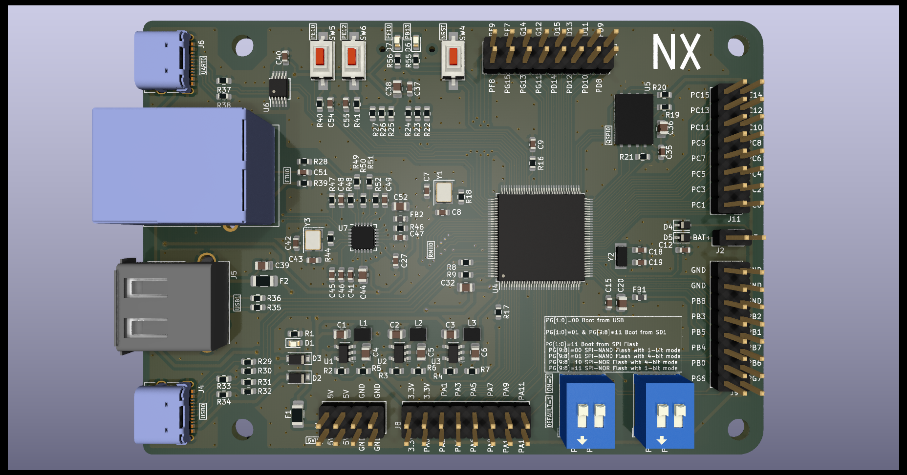
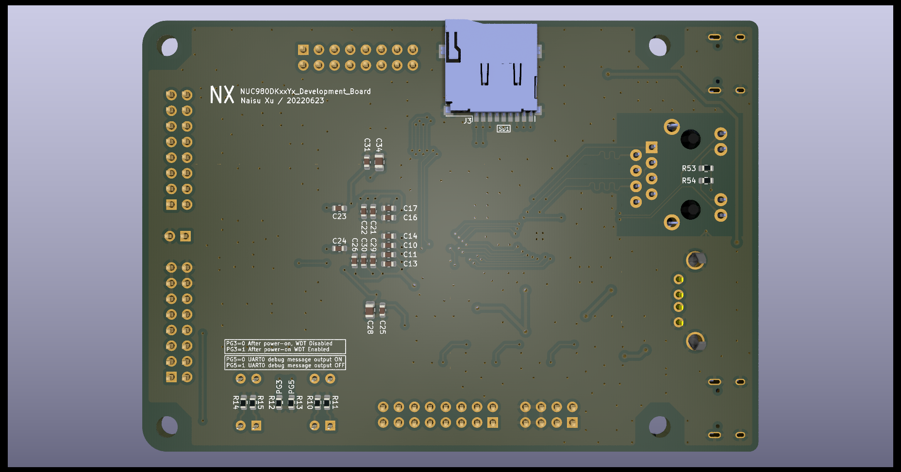

# NUC980DKxxYx_Development_Board

## Introduction

This is a development board project for Nuvoton NUC980 Series. It can be used for LQFP128 package chips such as NUC980DK61YC, NUC980DK71YC.

This project is designed with [Kicad](https://www.kicad.org/).

## 3D Views

## What is the NUC980

> The NUC980 series with the ARM926EJ-S core can operate at up to 300 MHz . It offers 64-pin, 128-pin and 216-pin LQFP packages stacked with 64 MB and 128 MB DDR-II Memory to reduce PCB size and EMI issues. Rich peripherals include 10 sets of UART , dual Ethernet, 4 sets CAN 2.0B, dual SDIO / eMMC interface, NAND Flash interface, QSPI NAND, 8 Ports USB Host, ISO-7816 interface and High-Speed USB 2.0 host / device controller to allow more flexibility in designs. The NUC980 also integrates the crypto engine which provides hardware acceleration for AES, SHA, ECC, RSA  function.
>
> It supports industrial temperature from - 40 ℃  to 85 ℃  and targets Industrial Control, Industrial IoT Gateway, Network Printer, Meter Concentrator and Smart Home Gateway applications.

For more details see the Nuvoton website: [NUC980 工业控制物联网系列](https://www.nuvoton.com.cn/products/microprocessors/arm9-mpus/nuc980-industrial-control-iot-series/)

## License
 This work is licensed under a <a rel="license" href="http://creativecommons.org/licenses/by-sa/4.0/">Creative Commons Attribution-ShareAlike 4.0 International License</a>.

